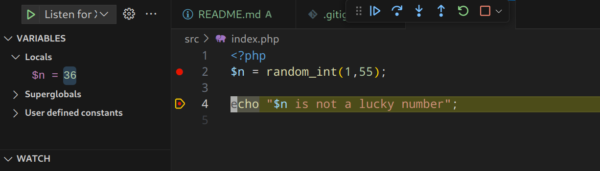
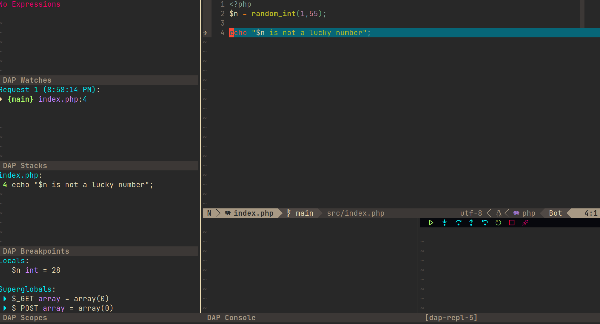

# PHP debugging

Boilerplate to test php debugging in neovim and vscode

php 8.3 + xdebug 3

## Launch container

Launch container

```bash
docker compose up
```

## Vscode config



```yaml
[
  {
    "name": "Listen for Xdebug Docker Src",
    "type": "php",
    "request": "launch",
    "port": 9003,
    "pathMappings": { "/var/www/html": "${workspaceFolder}/src" },
  },
]
```

## Neovim dap config



```lua
 {
    type = "php",
    request = "launch",
    name = "Listen for Xdebug docker WS",
    port = 9003,
    pathMappings = {
        ["/var/www/html"] = "${workspaceFolder}",
    },
},

```

## Troubleshooting

Adjust `pathMapping` to your src directory in container

default : /var/www/html => ./src

